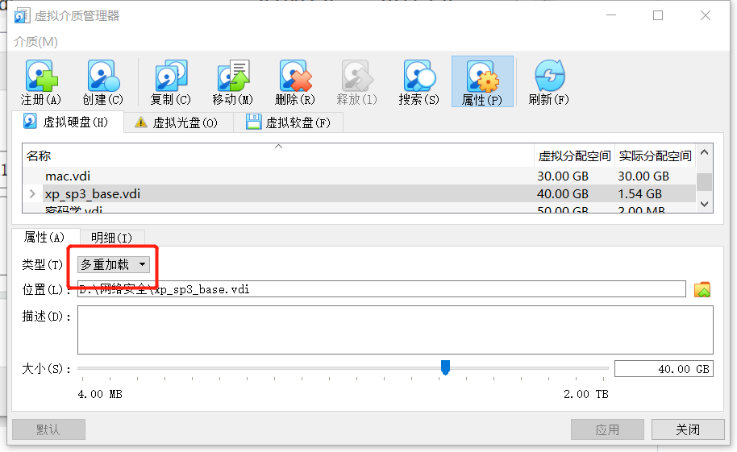
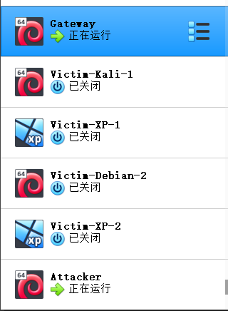
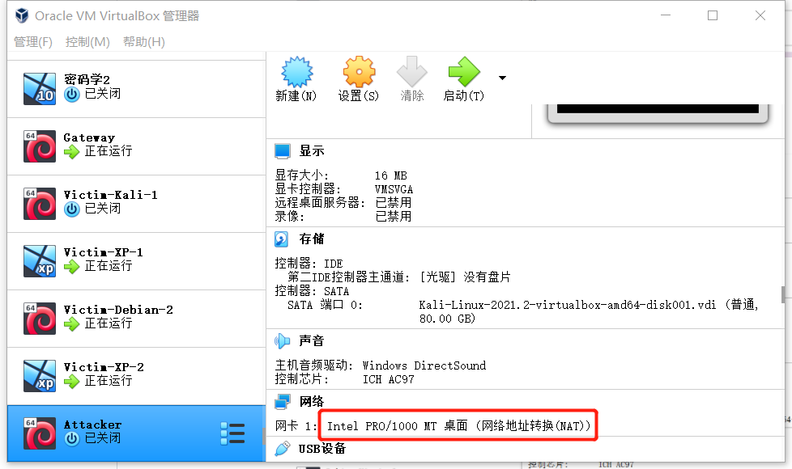

# 基于 VirtualBox 的网络攻防基础环境搭建

## 实验目的
- 掌握 VirtualBox 虚拟机的安装与使用；
- 掌握 VirtualBox 的虚拟网络类型和按需配置；
- 掌握 VirtualBox 的虚拟硬盘多重加载；

## 实验环境
以下是本次实验需要使用的网络节点说明和主要软件举例：
- VirtualBox 虚拟机
- 攻击者主机（Attacker）：Kali Rolling 2109.2
- 网关（Gateway, GW）：Debian Buster
- 靶机（Victim）：From Sqli to shell / xp-sp3 / Kali

## 实验要求
- 虚拟硬盘配置成多重加载，效果如下图所示；

- 搭建满足如下拓扑图所示的虚拟机网络拓扑；

> 根据实验宿主机的性能条件，可以适度精简靶机数量
- 完成以下网络连通性测试；
    - [ ] 靶机可以直接访问攻击者主机
    - [ ] 攻击者主机无法直接访问靶机
    - [ ] 网关可以直接访问攻击者主机和靶机
    - [ ] 靶机的所有对外上下行流量必须经过网关
    - [ ] 所有节点均可以访问互联网

## 实验步骤
1. 将虚拟硬盘`debian`和`xp`配置为多重加载
    - 管理 -> 虚拟介质管理 -> 选择待配置镜像 -> 修改属性中的类型为“多重加载”
        
        

2. 新建实验所需虚拟机并修改其网络配置
- 

- 网关gateway

    | 网络类型 | IP地址 |
    | --- | --- |
    | NAT | 10.0.2.15 |
    | Host-Only | 192.168.56.113 |
    | intnet1| 172.16.111.1 |
    | intnet2| 172.16.222.1 | 
---
- victim-kali-1

    | 网络类型 | IP地址 |
    | --- | --- |
    | intnet1| 172.16.111.111 |
---
- victim-xp-1

    | 网络类型 | IP地址 |
    | --- | --- |
    | intnet1| 172.16.111.142 |
---
- victim-debian-2

    | 网络类型 | IP地址 |
    | --- | --- |
    | intnet2 | 172.16.222.116 |
---
- victim-xp-2

    | 网络类型 | IP地址 |
    | --- | --- |
    | intnet2 | 172.16.222.148 |
---
- attacker

    | 网络类型 | IP地址 |
    | --- | --- |
    | NAT| 10.0.2.15 |

3. 连通性测试
    - 靶机可以直接访问攻击者主机
        - `ping 10.0.2.15`
        
        

    - 攻击者主机无法直接访问靶机
        

    - 网关可以直接访问攻击者主机和靶机
        

    - 靶机的所有对外上下行流量必须经过网关
        
        
        

    - 所有结点均可以访问互联网
        
        
        

## 参考资料
- [1.12第一章课后实验详解](https://www.bilibili.com/video/BV1CL41147vX?p=12)