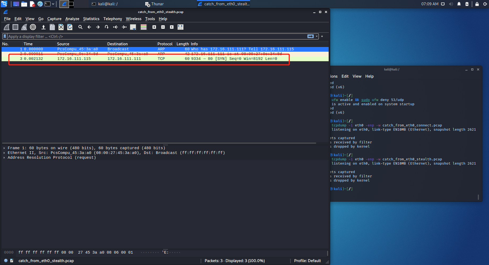

# 基于Scapy编写端口扫描器

### 实验目的

- 掌握网络扫描之端口状态探测的基本原理

### 实验环境

- python + scapy

### 实验要求

- 禁止探测互联网上的 IP ，严格遵守网络安全相关法律法规
- 完成以下扫描技术的编程实现
  - TCP connect scan / TCP stealth scan
  - TCP Xmas scan / TCP fin scan / TCP null scan
  - UDP scan
- 上述每种扫描技术的实现测试均需要测试端口状态为：`开放`、`关闭` 和 `过滤` 状态时的程序执行结果
- 提供每一次扫描测试的抓包结果并分析与课本中的扫描方法原理是否相符？如果不同，试分析原因；
- 在实验报告中详细说明实验网络环境拓扑、被测试 IP 的端口状态是如何模拟的
- （可选）复刻 `nmap` 的上述扫描技术实现的命令行参数开关

### 网络拓扑


### 端口状态模拟

```
sudo apt-get update
sudo apt-get install ufw
sudo apt-get install dnsmasq
```

- 开启状态

  - ```
    systemctl start apache2
    systemctl start dnsmasq
    ```

- 关闭状态

  - ```
    ufw disable
    systemctl stop apache2
    systemctl stop dnsmasq
    ```

- 过滤状态

  - ```
    sudo ufw enable && ufw deny 80/tcp
    sudo ufw enable && ufw deny 53/udp
    ```

### 实验步骤

- TCP connect scan

  - 

  - 代码

    - ```python
      import logging
      from scapy.all import *
      logging.getLogger("scapy.runtime").setLevel(logging.ERROR)
      
      dst_ip = "172.16.111.111"
      src_port = RandShort()
      dst_port = 80
      
      print('TCP connect scan:')
      print('-----------------------------------------')
      tcp_connect_scan_resp = sr1(IP(dst=dst_ip)/TCP(sport=src_port,dport=dst_port,flags="S"),timeout=10)
      print('-----------------------------------------')
      
      
      if(str(type(tcp_connect_scan_resp))=="<class 'NoneType'>"):
          print('State of port '+ str(dst_port) +' on '+ str(dst_ip) +": Closed")
      elif(tcp_connect_scan_resp.haslayer(TCP)):
          if(tcp_connect_scan_resp.getlayer(TCP).flags == 0x12):       
              send_rst = sr(IP(dst=dst_ip)/TCP(sport=src_port,dport=dst_port,flags="AR"),timeout=10)
              print('State of port '+ str(dst_port) +' on '+ str(dst_ip) +": Open")
          elif(tcp_connect_scan_resp.getlayer(TCP).flags == 0x14):
              # 
              print('State of port '+ str(dst_port) +' on '+ str(dst_ip) +": Closed")
      elif(tcp_connect_scan_resp.haslayer(ICMP)):
          if(int(tcp_connect_scan_resp.getlayer(ICMP).type)==3 and int(tcp_connect_scan_resp.getlayer(ICMP).code) in [1,2,3,9,10,13]):
              print('State of port '+ str(dst_port) +' on '+ str(dst_ip) +": Filtered")
      ```

  - 端口开放时

    - 

  - 端口关闭时

    - 

  - 端口过滤时

    - 

  - nmap

    - ```
      nmap -sT -p 80 172.16.111.111
      ```

    - 

    - 

    - 

  - 与所学原理相符

- TCP stealth scan

  - 

  - 代码

    - ```python
      import logging
      from scapy.all import *
      logging.getLogger("scapy.runtime").setLevel(logging.ERROR)
      
      dst_ip = "172.16.111.111"
      src_port = RandShort()
      dst_port=80
      
      print('TCP stealth scan:')
      print('-----------------------------------------')
      stealth_scan_resp = sr1(IP(dst=dst_ip)/TCP(sport=src_port,dport=dst_port,flags="S"),timeout=10)
      print('-----------------------------------------')
      
      if(str(type(stealth_scan_resp))=="<class 'NoneType'>"):
          print('State of port '+ str(dst_port) +' on '+ str(dst_ip) +": Filtered")
      elif(stealth_scan_resp.haslayer(TCP)):
          if(stealth_scan_resp.getlayer(TCP).flags == 0x12):
              send_rst = sr(IP(dst=dst_ip)/TCP(sport=src_port,dport=dst_port,flags="R"),timeout=10)
              print('State of port '+ str(dst_port) +' on '+ str(dst_ip) +": Open")
          elif (stealth_scan_resp.getlayer(TCP).flags == 0x14):
              print('State of port '+ str(dst_port) +' on '+ str(dst_ip) +": Closed")
      elif(stealth_scan_resp.haslayer(ICMP)):
          if(int(stealth_scan_resp.getlayer(ICMP).type)==3 and int(stealth_scan_resp.getlayer(ICMP).code) in [1,2,3,9,10,13]):
              print('State of port '+ str(dst_port) +' on '+ str(dst_ip) +": Filtered")
      ```

  - 端口开放时

    - 

  - 端口关闭时

    - 

  - 端口过滤时

    - 

  - nmap

    - ```
      sudo nmap -sS -p 80 172.16.111.111
      ```

    - 

    - 

    - 

  - 与所学原理相符

- TCP Xmas scan

  - 

  - 代码

    - ```python
      from scapy.all import *
      import logging
      logging.getLogger("scapy.runtime").setLevel(logging.ERROR)
      
      dst_ip = "172.16.111.111"
      src_port = RandShort()
      dst_port = 80
      
      print('TCP xmas scan:')
      print('-----------------------------------------')
      xmas_scan_resp = sr1(IP(dst=dst_ip)/TCP(dport=dst_port,flags="FPU"),timeout=10)
      print('-----------------------------------------')
      
      if (str(type(xmas_scan_resp))=="<class 'NoneType'>"):
          print('State of port '+ str(dst_port) +' on '+ str(dst_ip) +": Filtered or Open")
      elif(xmas_scan_resp.haslayer(TCP)):
          if(xmas_scan_resp.getlayer(TCP).flags == 0x14):
              print('State of port '+ str(dst_port) +' on '+ str(dst_ip) +": Closed")
      elif(xmas_scan_resp.haslayer(ICMP)):
          if(int(xmas_scan_resp.getlayer(ICMP).type)==3 and int(xmas_scan_resp.getlayer(ICMP).code) in [1,2,3,9,10,13]):
              print('State of port '+ str(dst_port) +' on '+ str(dst_ip) +": Filtered")
      ```

  - 端口开放时

    - 

  - 端口关闭时

    - 

  - 端口过滤时

    - 

  - nmap

    - ```
      sudo nmap -sX -p 80 172.16.111.111
      ```

    - 

    - 

  - 与所学原理相符

- TCP fin scan

  - 

  - 代码

    - ```python
      import logging
      logging.getLogger("scapy.runtime").setLevel(logging.ERROR)
      from scapy.all import *
      
      dst_ip = "172.16.111.111"
      src_port = RandShort()
      dst_port = 80
      
      print('TCP fin scan:')
      print('-----------------------------------------')
      fin_scan_resp = sr1(IP(dst=dst_ip)/TCP(sport=src_port,dport=dst_port,flags="F"),timeout=10)
      print('-----------------------------------------')
      
      if (str(type(fin_scan_resp))=="<class 'NoneType'>"):
          print('State of port '+ str(dst_port) +' on '+ str(dst_ip) +": Filtered or Open")
      elif(fin_scan_resp.haslayer(TCP)):
          if(fin_scan_resp.getlayer(TCP).flags == 0x14):
              print('State of port '+ str(dst_port) +' on '+ str(dst_ip) +": Closed ")
      elif(fin_scan_resp.haslayer(ICMP)):
          if(int(fin_scan_resp.getlayer(ICMP).type)==3 and int(fin_scan_resp.getlayer(ICMP).code) in [1,2,3,9,10,13]):
              print('State of port '+ str(dst_port) +' on '+ str(dst_ip) +": Filtered")
      ```

  - 端口开放时

    - 

  - 端口关闭时

    - 

  - 端口过滤时

    - 

  - nmap

    - ```
      sudo nmap -sF -p 80 172.16.111.111
      ```

    - 

    - 

  - 与所学原理相符

- TCP null scan

  - 

  - 代码

    - ```python
      import logging
      logging.getLogger("scapy.runtime").setLevel(logging.ERROR)
      from scapy.all import *
      
      dst_ip = "172.16.111.111"
      src_port = RandShort()
      dst_port = 80
      
      print('TCP null scan:')
      print('-----------------------------------------')
      null_scan_resp = sr1(IP(dst=dst_ip)/TCP(dport=dst_port,flags=""),timeout=10)
      print('-----------------------------------------')
      
      if (str(type(null_scan_resp))=="<class 'NoneType'>"):
          print('State of port '+ str(dst_port) +' on '+ str(dst_ip) +": Filtered or Open")
      elif(null_scan_resp.haslayer(TCP)):
          if(null_scan_resp.getlayer(TCP).flags == 0x14):
              print('State of port '+ str(dst_port) +' on '+ str(dst_ip) +": Closed ")
      elif(null_scan_resp.haslayer(ICMP)):
          if(int(null_scan_resp.getlayer(ICMP).type)==3 and int(null_scan_resp.getlayer(ICMP).code) in [1,2,3,9,10,13]):
              print('State of port '+ str(dst_port) +' on '+ str(dst_ip) +": Filtered")
      ```

  - 端口开放时

    - 

  - 端口关闭时

    - 

  - 端口过滤时

    - 

  - nmap

    - ```
      sudo nmap -sN -p 80 171.16.111.111
      ```

    - 

    - 

  - 与所学原理相符

- UDP scan

  - 

  - 代码

    - ```python
      import logging
      logging.getLogger("scapy.runtime").setLevel(logging.ERROR)
      from scapy.all import *
      
      dst_ip = "172.16.111.111"
      src_port = RandShort()
      dst_port = 53
      dst_timeout = 1
      
      print('UDP scan:')
      
      def udp_scan(dst_ip,dst_port,dst_timeout):
          print('-----------------------------------------')
          udp_scan_resp = sr1(IP(dst=dst_ip)/UDP(dport=dst_port),timeout=dst_timeout)
          print('-----------------------------------------')
          if (str(type(udp_scan_resp))=="<class 'NoneType'>"):
              retrans = []
              for count in range(0,3):
                  retrans.append(sr1(IP(dst=dst_ip)/UDP(dport=dst_port),timeout=dst_timeout))
              for item in retrans:
                  if (str(type(item))!="<class 'NoneType'>"):
                      udp_scan(dst_ip,dst_port,dst_timeout)
              print('State of port '+ str(dst_port) +' on '+ str(dst_ip) +": Filtered or Open")
          elif (udp_scan_resp.haslayer(UDP) or udp_scan_resp.getlayer(IP).proto == IP_PROTOS.udp):
              print('State of port '+ str(dst_port) +' on '+ str(dst_ip) +": Open")
          elif(udp_scan_resp.haslayer(ICMP)):
              if(int(udp_scan_resp.getlayer(ICMP).type)==3 and int(udp_scan_resp.getlayer(ICMP).code)==3):
                  print('State of port '+ str(dst_port) +' on '+ str(dst_ip) +": Closed")
              elif(int(udp_scan_resp.getlayer(ICMP).type)==3 and int(udp_scan_resp.getlayer(ICMP).code) in [1,2,9,10,13]):
                  print('State of port '+ str(dst_port) +' on '+ str(dst_ip) +": Filtered")
      
      udp_scan(dst_ip,dst_port,dst_timeout)
      ```

  - 端口开放时

    - 

  - 端口关闭时

    - 

  - 端口过滤时

    - 

  - nmap

    - ```
      sudo nmap -sU -p 53 172.16.111.111
      ```

    - 

    - 

    - 

  - 与所学原理相符

### 参考文献

- [nmap扫描kali linux 中ip 显示：Note: Host seems down. If it is really up, but blocking our ping probes.](https://blog.csdn.net/id__39/article/details/107446378)